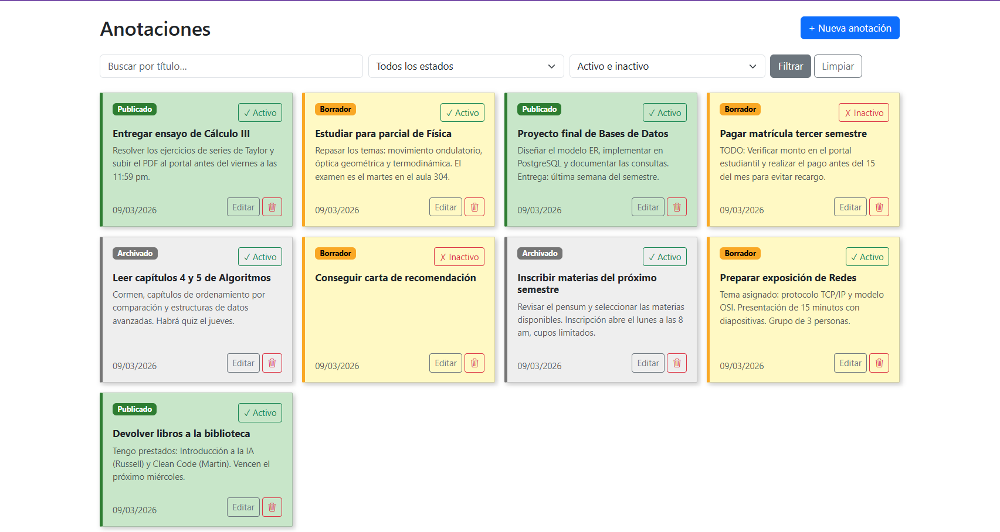

# Django CRUD Reutilizable — Anotaciones

Proyecto Django que demuestra el diseño de un **motor CRUD reutilizable** basado en herencia de clases, con módulos de negocio conectados por herencia/configuración y separación limpia de capas.


Lista principal de anotaciones con filtros y acciones rápidas (editar, activar/inactivar, eliminar). 
Ver en /notas/ después de correr el proyecto.


---

## Cómo correr el proyecto

```bash
# 1. Crear y activar el entorno virtual
python -m venv venv
venv\Scripts\activate        # Windows
source venv/bin/activate     # Linux/Mac

# 2. Instalar dependencias
pip install django django-widget-tweaks

# 3. Aplicar migraciones
cd crudproject
python manage.py migrate

# 4. Crear superusuario
python manage.py createsuperuser

# 5. (Opcional) Cargar datos de prueba
python manage.py seed          # Inserta 10 anotaciones de ejemplo
python manage.py seed --flush  # Borra las existentes y re-inserta

# 6. Correr el servidor
python manage.py runserver
```

Abrir en el navegador:
- **Listado de anotaciones:** http://127.0.0.1:8000/notas/
- **Admin (incluye ControlCambio):** http://127.0.0.1:8000/admin/
- **JSON API:** http://127.0.0.1:8000/notas/json/

> Se requiere autenticarse. Al acceder sin sesión, Django redirige a `/admin/login/`.

---

## Estructura del proyecto

```
crudproject/
│
├── core/               # App transversal — Motor CRUD reutilizable
│   ├── views.py        #   BaseCrudView: clase base con todo el CRUD
│   ├── audit.py        #   Módulo de auditoría: ControlCambio + helpers
│   ├── models.py       #   Modelo ControlCambio (tabla de auditoría)
│   └── urls.py         #   (reservado para rutas transversales)
│
├── notes/              # App de negocio — Módulo Anotaciones
│   ├── models.py       #   Modelo Anotacion
│   ├── forms.py        #   AnotacionForm con validaciones
│   ├── views.py        #   AnotacionCrudView (hereda de BaseCrudView)
│   ├── urls.py         #   Rutas generadas por get_urls()
│   ├── admin.py        #   Registro en Django Admin
│   └── management/commands/seed.py  # Comando de datos de prueba
│
├── ui/                 # App de presentación — Templates Bootstrap 5
│   └── templates/
│       ├── base.html           # Layout base
│       └── notes/
│           ├── list.html       # Listado tipo post-it con filtros
│           └── form.html       # Formulario crear/editar/eliminar
│
└── crudproject/        # Configuración del proyecto Django
    ├── settings.py
    └── urls.py
```

---

## Diseño del motor base (`BaseCrudView`)

`core/views.py` implementa `BaseCrudView`, una clase vista Django que resuelve el CRUD completo de forma genérica y **reutilizable por herencia**.

### Operaciones incluidas en la base

| Ruta generada          | Acción                                           |
|------------------------|--------------------------------------------------|
| `GET /`                | Listado filtrado (`ListView`)                    |
| `GET /json/`           | Datos en JSON con búsqueda y filtro (`JsonView`) |
| `GET /add/`            | Formulario de creación (`AddView`)               |
| `POST /add/`           | Guardar nueva instancia                          |
| `GET /<pk>/`           | Formulario de edición                            |
| `POST /<pk>/`          | Guardar cambios                                  |
| `POST /<pk>/toggle/`   | Activar / Inactivar (`ToggleView`)               |
| `POST /<pk>/delete/`   | Eliminar objeto (`DeleteView`)                   |

> La eliminación usa `POST` (no `DELETE`) porque los formularios HTML solo soportan GET/POST. El frontend envía el request vía `fetch` con el token CSRF, lo que es el patrón estándar de Django para acciones destructivas.

### Atributos configurables por la subclase

```python
model          # Modelo Django gestionado
form_class     # ModelForm asociado
template_name  # Template del listado
form_template  # Template del formulario
list_display   # Columnas visibles en listado y JSON
search_fields  # Campos donde se busca por texto (icontains)
filter_field   # Campo de filtro por valor exacto (ej: 'estado')
active_field   # Campo booleano para activar/inactivar (default: 'activo')
```

### Hooks de ciclo de vida

Los métodos hook permiten extender el flujo sin duplicar el motor:

```python
get_queryset(request)                                      # Queryset base
get_form(request, instance)                                # Instanciar y personalizar el form
get_context_data(request, **kwargs)                        # Variables extra al template
before_save(request, obj, form, is_create, original)       # Antes de .save()
after_save(request, obj, form, is_create, original)        # Después de .save()
before_toggle(request, obj)                                # Antes de invertir activo
after_toggle(request, obj)                                 # Después de invertir activo
```

### Registro de rutas centralizado

El método de clase `get_urls()` genera todos los `path()` del módulo. El `urls.py` de la app de negocio simplemente llama:

```python
urlpatterns = AnotacionCrudView.get_urls()
```

Esto evita dispersar rutas y garantiza que cualquier módulo nuevo que herede de `BaseCrudView` quede integrado con una sola línea.

---

## Módulo de auditoría (`core/audit.py`)

Toda operación del motor queda registrada automáticamente en la tabla `ControlCambio` sin intervención de la subclase.

### Modelo `ControlCambio`

| Campo       | Tipo           | Descripción                                       |
|-------------|----------------|---------------------------------------------------|
| `usuario`   | FK → User      | Usuario autenticado que realizó la acción         |
| `accion`    | CharField      | `CREAR`, `EDITAR`, `ELIMINAR`, `ACTIVAR`, `INACTIVAR` |
| `modelo`    | CharField      | Identificador del modelo afectado (e.g. `notes.Anotacion`) |
| `objeto_id` | PositiveInt    | PK del objeto afectado                            |
| `fecha`     | DateTimeField  | Fecha y hora automática (`auto_now_add`)           |
| `cambios`   | JSONField      | Detalle estructurado de los campos modificados    |

### Helpers en `core/audit.py`

- **`build_cambios_create(form)`** — genera `{campo: {anterior: null, nuevo: valor}}` para creaciones.
- **`build_cambios_edit(form, original)`** — genera `{campo: {anterior, nuevo}}` solo para campos que cambiaron.
- **`registrar_cambio(usuario, accion, obj, cambios, *, modelo, objeto_id)`** — persiste el registro. Acepta `obj` directo (crear/editar/toggle) o `modelo` + `objeto_id` cuando el objeto ya fue eliminado.

El motor llama a `registrar_cambio` automáticamente en `post()`, `toggle()` y `delete()`. La subclase no necesita hacer nada para que la auditoría funcione.

---

## Override en la clase hija y justificación

`notes/views.py` implementa `AnotacionCrudView(BaseCrudView)` con tres personalizaciones motivadas por reglas de negocio:

### Override 1 — `get_form`: bloquear título en anotaciones publicadas

```python
def get_form(self, request, instance=None):
    form = super().get_form(request, instance)
    # REGLA: El título no puede editarse una vez que la anotación está PUBLICADA
    if instance and instance.estado == 'PUBLICADO':
        form.fields['titulo'].disabled = True
    return form
```

**Por qué:** Una anotación publicada tiene difusión; cambiar su título causaría inconsistencias de referencia. El bloqueo ocurre a nivel de formulario (campo `disabled`) y se refuerza también en `before_save`.

### Override 2 — `before_save`: asignar autor + reforzar regla de título

```python
def before_save(self, request, obj, form, is_create, original=None):
    if is_create:
        obj.created_by = request.user   # El autor siempre viene del backend

    # Refuerzo de seguridad: aunque el campo esté deshabilitado en el HTML,
    # alguien podría enviar el campo vía POST manual
    if original and original['estado'] == 'PUBLICADO':
        if obj.titulo != original['titulo']:
            raise ValidationError('No se puede modificar el título de una anotación publicada.')
```

**Por qué:** `created_by` nunca debe venir del formulario POST (riesgo de manipulación). El doble chequeo del título protege contra clientes que ignoren el `disabled` del HTML.

### Override 3 — `after_save`: evento de negocio al publicar

```python
def after_save(self, request, obj, form, is_create, original=None):
    was_published = original['estado'] == 'PUBLICADO' if original else False
    if obj.estado == 'PUBLICADO' and not was_published:
        logger.info(f"Anotación ID {obj.id} publicada por {request.user}")
```

**Por qué:** Toda transición a `PUBLICADO` tiene relevancia para el negocio (más allá de la auditoría genérica del motor). El hook `after_save` es el lugar correcto porque el objeto ya está persistido y tiene PK. La auditoría genérica (registro en `ControlCambio`) la gestiona el motor base; este hook solo añade el log de negocio específico.

---

## Cómo se garantiza "stateless por request"

1. **Sin atributos de instancia dependientes del request:** `BaseCrudView` solo declara atributos de *configuración de clase* (`model`, `form_class`, etc.) que son constantes para todas las peticiones. Nunca se escribe `self.request`, `self.user` ni ningún dato de sesión como atributo de instancia.

2. **Toda la información fluye por parámetros:** Cada método recibe `request` explícitamente y lo pasa a los hooks. No existe estado acumulado entre llamadas ni entre requests.

3. **Django crea una instancia nueva por cada request:** Por diseño de `View.as_view()`, cada petición HTTP obtiene una instancia fresca de la clase. Incluso si se escribiera un atributo de instancia por error, desaparecería al finalizar el request.

4. **LoginRequiredMixin en `dispatch()`:** La verificación de autenticación ocurre por request, en el mismo ciclo de vida de la petición. No se cachea el usuario en la clase.

---

## Validaciones del módulo de negocio

Implementadas en `notes/forms.py` (capa de formulario):

- `titulo` mínimo 5 caracteres (`clean_titulo`)
- Si `estado == PUBLICADO`, `detalle` es obligatorio (`clean`)

Reglas adicionales en `notes/views.py` (`before_save`):

- `created_by` se asigna desde `request.user`, nunca desde POST
- El título no puede cambiarse en anotaciones ya publicadas
